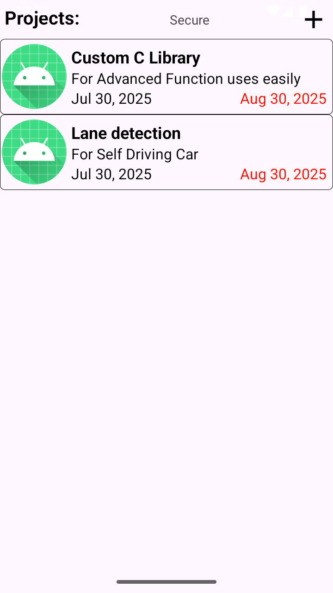

# 📁 Project Manager

**Project Manager** is an Android application designed to help developers, freelancers, and startup owners efficiently **create, manage, and track multiple personal or private projects** — all from their phone.

---

## ✨ Features

- ✅ Create and manage multiple **projects** from idea to completion.
- 🔐 **Password authentication** to protect your project data.
- 🧠 Add **future features/reminders** to any project.
- 🗃️ Store all data securely in a **local JSON file** on your phone (no internet needed).
- 📌 Track project **states**: Idea → Coding → Verified → Completed.
- 🔍 Organize your work by:
  - 📌 **Project**
  - 🏷️ **Version**
  - 💬 **Discussion**
  - 📚 **Topics**
- 📈 Easily track what feature/version was added when.
- 💡 Especially useful for:
  - Android developers maintaining multiple versions.
  - Startup owners planning long-term app strategies.

---

---
## Apk File To Test

| Apk File |
|----------------|
| Apk File to test is in ApkFileToTest folder |
| And the password of application is "tinku" |

---
---

## 📸 Screenshots

| Project List | Project Details | Add Version topics |
|--------------|------------------|------------------|
|  |  |  |

| Feature Planning | Version Tracking | Password Lock |
|------------------|------------------|----------------|
|  |  |  |


---

## 🔒 Security

- All data is **stored locally** in encrypted JSON format.
- **Authentication required** to access the app — keeping your ideas private.

---

## 📦 Tech Stack

- 📱 Android (Java)
- 📁 Local file storage (JSON)
- 🔐 Password authentication

---

## 🚀 Use Case Examples

- Plan out startup ideas from scratch.
- Maintain changelogs and features per app version.
- Keep a clear record of what's done and what's planned.
- Brain-dump new ideas while offline.

---

## 📥 Installation

1. Clone this repo:
   ```bash
   git clone https://github.com/ShyamVermaG/ProjectManager.git


---

## How to Use

  1. First install app
  2. Then login using password "tinku"
  3. Then create projects by click on + button 
  4. To go inside the project to create version simply click on it.
  5. if you want to update the status or view inside projects, version, task just long press on it and you will see lots of actions there.
  6. It will automatic store the changes in your file if you come back and close the app.
  7. if you want to store it manually just click on top middle button "Secure" to store all the changes.

## 📥 Some Issues

  1. It crashed when we long click on any discussion.
  2. It will crash when we try to view inside projects.
  3. Image upload section not working.


## we are happy if you want to contribute to our project or use it 
  Give a Hand to make this world more Comfortable.
  Thanks in Advance.
  Happy Coding.
