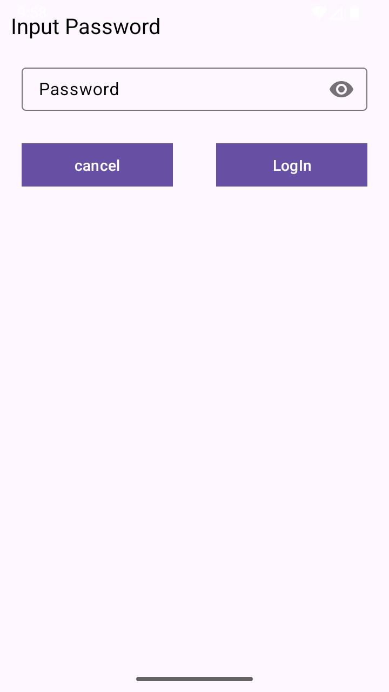
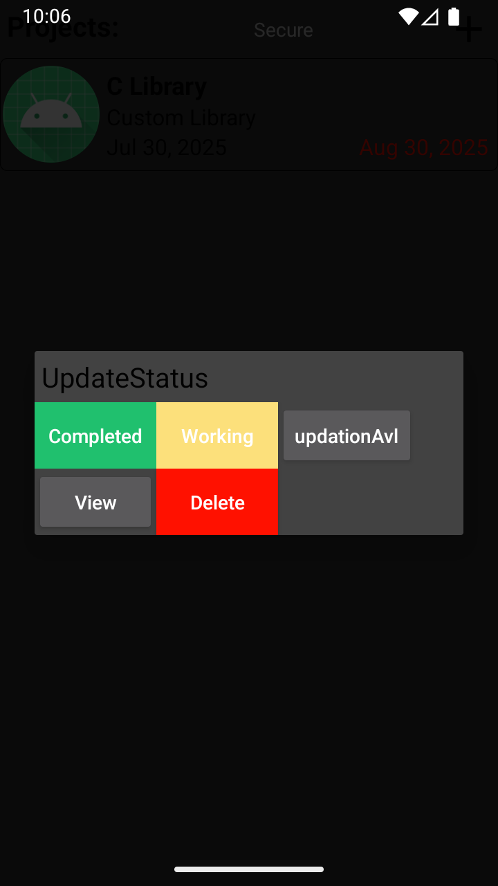

# 📁 Project Manager

**Project Manager** is an Android application designed to help developers, freelancers, and startup owners efficiently **create, manage, and track multiple personal or private projects** — all from their phone.

---

## ✨ Features

- ✅ Create and manage multiple **projects** from idea to completion.
- 🔐 **Password authentication** to protect your project data.
- 🧠 Add **future features/reminders** to any project.
- 🗃️ Store all data securely in a **local JSON file** on your phone (no internet needed).
- 📌 Track project **states**: Idea → Coding → Verified → Completed.
- 🔍 Organize your work by:
  - 📌 **Project**
  - 🏷️ **Version**
  - 💬 **Discussion**
  - 📚 **Topics**
- 📈 Easily track what feature/version was added when.
- 💡 Especially useful for:
  - Android developers maintaining multiple versions.
  - Startup owners planning long-term app strategies.

---

## 📸 Screenshots

| Project List | Project Details | Add New Project |
|--------------|------------------|------------------|
|  |  |  |

| Feature Planning | Version Tracking | Password Lock |
|------------------|------------------|----------------|
|  |  |  |

> 📁 Place your screenshots inside a `screenshots/` folder in the repo root.

---

## 🔒 Security

- All data is **stored locally** in encrypted JSON format.
- **Authentication required** to access the app — keeping your ideas private.

---

## 📦 Tech Stack

- 📱 Android (Java)
- 📁 Local file storage (JSON)
- 🔐 Password authentication

---

## 🚀 Use Case Examples

- Plan out startup ideas from scratch.
- Maintain changelogs and features per app version.
- Keep a clear record of what's done and what's planned.
- Brain-dump new ideas while offline.

---

## 📥 Installation

1. Clone this repo:
   ```bash
   git clone https://github.com/ShyamVermaG/ProjectManager.git
